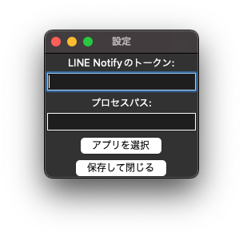
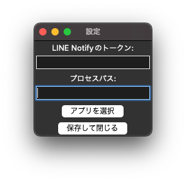

    
    <h1 align="center">ProcessGuardian for macOS</h1>

    

ProcessGuardianは、あなたのシステムを静かに見守る信頼のプロセス監視ツールです。貴重なアプリケーションやサービスが予期せず停止した場合、ProcessGuardianがすぐに察知し、自動的に再起動を行います。この瞬間的な対応により、ダウンタイムを最小限に抑え、ビジネスの継続性を保証します。

## 特徴

- 自動再起動: システムの重要なプロセスが停止した場合、自動的に再起動します。
リアルタイム監視: プロセスの稼働状態を24時間365日リアルタイムで監視し、安定したシステム運用を支援します。
- 簡単設定: 直感的なインターフェースで、監視対象のプロセスを簡単に設定できます。
- LINE通知機能: プロセスの停止や再起動の際に、即座に通知を受け取ることができます。
- 安定性と信頼性: ビジネスクリティカルなアプリケーションの監視に最適化された高度な機能を提供します。

ProcessGuardianを使えば、システムの安定性を維持しながら、予期せず発生する問題に迅速に対応できます。あなたのIT環境を守るための最初の一歩として、ProcessGuardianを選んでください。

## 動作環境

ProcessGuardianは、以下の環境での使用を推奨します。

- OS: macOS 13以降

Venturaでテストされ問題なく動作することが確認されています。その他のバージョンでは動作未確認のためご了承ください。

## インストール方法

インストール方法は以下の通りです。

1. GitHubリポジトリの[最新のリリース](https://github.com/svertkatter/ProcessGuardian/releases)から`ProcessGuardian.dmg`をダウンロードしてください。
2. ダウンロードした`.dmg`を開き、`ProcessGuardian.app`を`アプリケーション`フォルダにドラッグアンドドロップしてください。
3. 🎉 インストール完了！ 🎉

## 使用方法

使用方法は以下の通りです。

### 1. 設定

これらの設定はドキュメントフォルダ（書類フォルダ）の`ProcessGuardian`フォルダに`settings.json`として保存されています。

#### LINE Notify トークンの設定

LINE Notifyのトークンを取得し、この欄に貼り付けてください。現在のバージョンではLINEしか対応していないため、[こちら](https://notify-bot.line.me/ja/)からLINEアカウントにログインし、マイページからトークンを発行してください。

#### プロセスパスの設定

ProcessGuardianはアプリのプロセスパスを監視して起動しているか否かを判定しています。アプリのプロセスパスは調べる必要はありません。アプリを開くをクリックし、監視してほしいアプリをアプリケーションフォルダから選択してください。自動でプロセスパスが生成されます。

### 2. ファイルの選択

監視して欲しいファイルを選択します。横のボタンをクリックし選択することで自動的に適用されます。

### 3. 監視間隔の設定

監視する間隔を設定します。単位は分です。初期値は30分です。

### 4. 監視開始

開始ボタンをクリックしてください。ログが表示され、LINEに通知が飛びます。